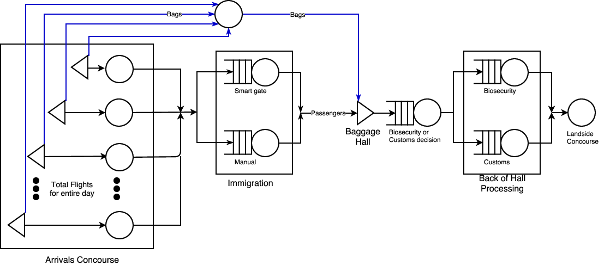
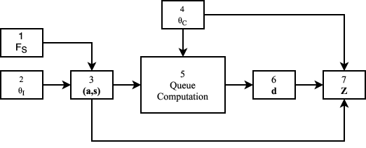
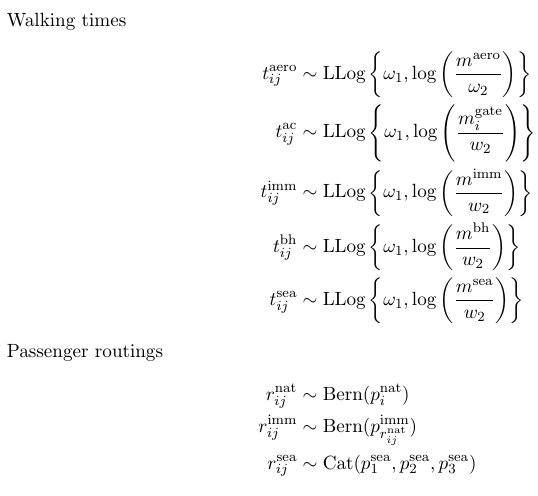
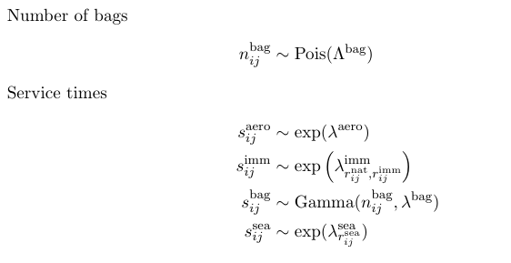
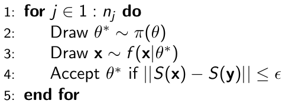
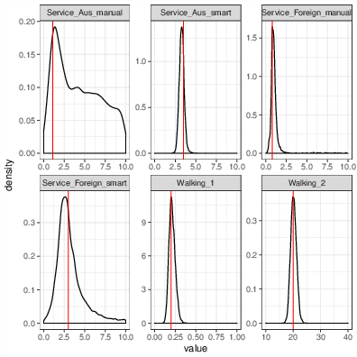
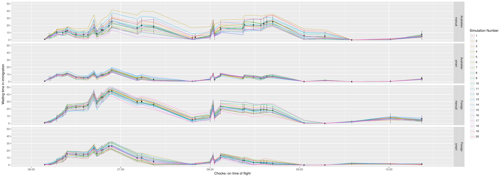
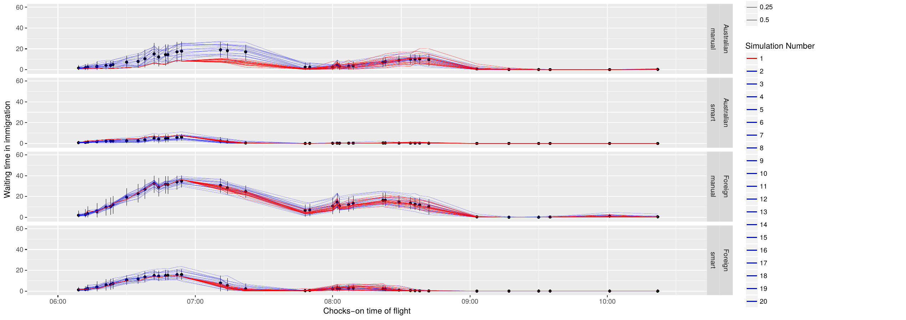

$$ $$


# Dynamic Queueing Networks: Simulation, Estimation and Prediction

<!-- http://acedesk.qut.edu.au/phd_day.html -->

## What's a queue?


## What's a queue? 

<!--  -->

Arrival time: $a_j$, when customer $j$ arrives

Service time: $s_j$, how much time customer $j$ needs with a server

Departure time: $d_j$, when customer $j$ has been served

Waiting time: $w_j = d_j - a_j - s_j$, how long customer $j$ waited to be served
 
## Kendall's notation

$f_{\delta} / f_s / K / C / n / R$

$f_{\delta}$: inter-arrival distribution

$f_s$: service distribution

$K$: number of servers

$C$: capacity of system

$n$: number of customers

$R$: service discipline

## Performance measures

system utilization: $\rho = \frac{\mu}{\lambda}$

The steady state probability of $N$ customers in a $M/M/K$ system is,

\[
\begin{align}
P(0) &= \left[\frac{ (K \rho)^K}{K! (1 - \rho)} + 1 + \sum_{i=1}^{K-1} \frac{(K \rho)^i}{i!}   \right]^{-1} \\
P(N) &= \begin{cases} 
P(0) \frac{(K \rho)^n }{N!} & \quad  N \leq K\\
P(0) \frac{(K \rho)^n }{K! K^{N-K}} & \text{otherwise}
\end{cases} , \label{eq:pn}
\end{align}
\]

## Simulation {.centered}


## It's fast {.centered}


Computation time in milliseconds for varying numbers of passengers for each
DES/queueing package. 

## Queueing Networks


Sutton, C., & Jordan, M. I. (2011). Bayesian inference for queueing networks and modeling of internet services. The Annals of Applied Statistics, 254-282.

## International Airport {.centered}



Queueing network model of an international airport terminal. 

## International Airport Data


## Approach



Simulation is used to convert $\mathbf{(a,s)}$ to departure times $\mathbf{d}$. $\mathbf{Z}$ in step 7 is a function of the $\mathbf{(a,s)}, \mathbf{d}$ and $\theta_C$. It reflects features such as average waiting time, average queue length and resource utilization.

## Simulation {.columns-2}





## Simulation {.codefont}

```{r airport_sim}
library(AirportSimulator)
suppressPackageStartupMessages(library(dplyr))

airport_simulate() %>% sample_frac()
```

## Estimation: Approximate Bayesian Computation

For many complex models $f (y|\theta)$ is easy to sample from but difficult or impossible to evaluate. Intuitively we may think that the best way to estimate $\theta$, based on observed data $y$, is to take samples from $f (y|\theta)$ with different values of $\theta$ until $x$ “looks like” $y$.



## Estimation: Maximum Mean Discrepancy

\[
\begin{align}
\widehat{\text{MMD}}^2_b(X,Y|s) &=  \frac{1}{m^2} \sum_{i,j = 1}^{m}  k(x_i, x_j) \\
 &\quad + \frac{1}{n^2} \sum_{i,j = 1}^{n} k(y_i, y_j) 
 -  \frac{2}{mn} \sum_{i,j = 1}^{m,n}  k(x_i, y_j). 
\end{align}
\]

Gretton, A., Borgwardt, K. M., Rasch, M., Schölkopf, B., & Smola, A. J. (2007). A kernel method for the two-sample-problem. In Advances in neural information processing systems (pp. 513-520).

## Estimation {.codefont}

```{r airport_est}
library(AirportSimulator)

true_params <- c(0.2, 20, 1.1, 3.5, 0.8, 3)

y <- airport_sim_1(true_params)

x <- airport_sim_1(true_params)

airport_MMD(y,x, threshold = 6)

proposed_params <- c(0.2, 10, 0.5, 3.5, 0.8, 3)

x <- airport_sim_1(proposed_params)

airport_MMD(y,x, threshold = 6)
```

## Estimation {.codefont}
```{r, fig.height = 3}
library(tidyr)
library(ggplot2)
data_frame(y = unlist(y), x = unlist(x), input_output = rep(c("input", "output"), each = 15602)) %>% 
  gather(key = "key", value = "time", y, x) %>%
  ggplot(aes(x = time, col = input_output)) +  
  geom_density(adjust = 0.0001) +
  facet_grid(key ~ .)
```

## Estimation: Results {.centered}



ABC posterior distributions. 

## Prediction {.centered}



Distribution of average waiting time for passengers by flight. Resimulations with fixed parameters.  

## Prediction {.centered}



Particle resampling of trajectories with data assimilation. 

## Thank you! {.smaller}

 <br />

Anthony Ebert <br />
Supervised by: Kerrie Mengersen, Paul Wu, Fabrizio Ruggeri

Email: ac.ebert@qut.edu.au <br />
Github: AnthonyEbert <br />
Twitter: @ace_ebert 

Have a look at the R package `queuecomputer`

This work is supported by the Australian Research Council Centre of Excellence for Mathematical and Statistical Frontiers (ACEMS). 


