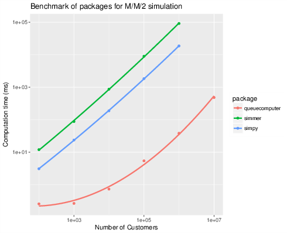
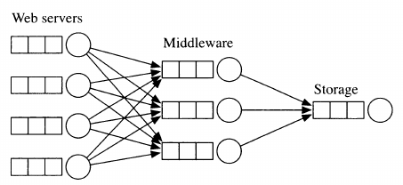
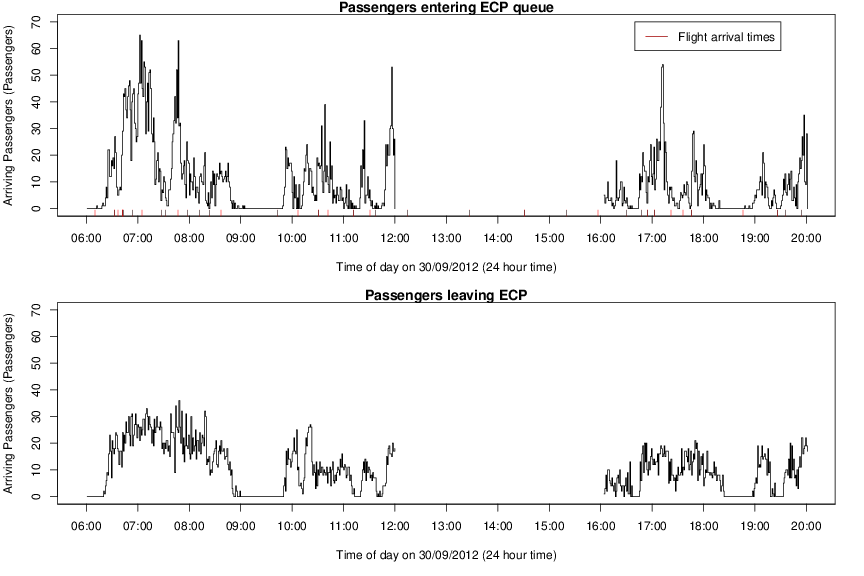

$$ $$

# Dynamic Queueing Networks: Simulation, Estimation and Prediction

<!-- http://acedesk.qut.edu.au/phd_day.html -->

## What's a queue?

## What's a queue? {.columns-2}

Arrival time: $a_j$, when customer $j$ arrives

Service time: $s_j$, how much time customer $j$ needs with a server

Departure time: $d_j$, when customer $j$ has been served
 
## Kendall's notation

$f_{\delta} / f_s / K / C / n / R$

$f_{\delta}$: inter-arrival distribution

$f_s$: service distribution

$K$: number of servers

$C$: capacity of system

$n$: number of customers

$R$: service discipline

## Performance measures

system utilization: $\rho = \frac{\mu}{\lambda}$

The steady state probability of $N$ customers in a $M/M/K$ system is,

\[
\begin{align}
P(0) &= \left[\frac{ (K \rho)^K}{K! (1 - \rho)} + 1 + \sum_{i=1}^{K-1} \frac{(K \rho)^i}{i!}   \right]^{-1} \\
P(N) &= \begin{cases} 
P(0) \frac{(K \rho)^n }{N!} & \quad  N \leq K\\
P(0) \frac{(K \rho)^n }{K! K^{N-K}} & \text{otherwise}
\end{cases} , \label{eq:pn}
\end{align}
\]

## Simulation {.centered}

R package queuecomputer

## It's fast {.centered}

## Queueing Networks

Sutton, C., & Jordan, M. I. (2011). Bayesian inference for queueing networks and modeling of internet services. The Annals of Applied Statistics, 254-282.

## International Airport

## Why you should care about Git/GitHub

  * Calling Git/Github a Distributed Version Control System is like calling Facebook a place where people post photos.
  * THERE'S SO MUCH MORE TO IT  
  * Github is:
      - A project collaboration platform
      - A social network
      - A disaster recovery system
      - A synchronisation service
      - A platform for disseminating your work. Reproducible Research Anyone?
      - A place to showcase your actual skills (>> Linked-In)
      - A blog hosting service 
      - A system for controlling your code versions.
      - A place for orhpaned code snippets.

## Basic building blocks of a GitHub project

  * 'Repositories' - Repos
  * 'Issues'
  * 'Files'
  * 'Commits'
  * 'Pushes'
  * 'Forks'
  * 'Branches' 
  * 'Pull-Requests' - PRs

## How to learn all this crap

  * Don't try. Get acquainted with the platform slowly: 
  * Level 0:
      - Use GitHub to manage your own solo projects. Not necessarily software. [This talk has a repo](https://github.com/MilesMcBain/burgr_20170913_github). 
      - Get acquainted with commiting, pushing and pulling. 
      - Use a git client like [GitKraken](https://www.gitkraken.com/).
      - Raise issues on repos for software you use:
          - Feature requests
          - Bug reports with a [reprex](http://www.njtierney.com/post/2017/01/11/magic-reprex/)
  * **DEMOS** Add a gif to this presentation.

## How to learn all this crap #2

  * Next level:
      - Fork someone else's repo, add code or documentation, make a pull request
      - [My First PR](http://firstpr.me) 
      - Collaborate with someone else on a shared project.
      - Merge your commits and resolve conflicts.

## Oh Shit Git

  * [Help is not far away](http://ohshitgit.com/).
  * [Gitflow](https://guides.github.com/introduction/flow/)

## My Github workflow

The easy way:

  * Create the Repo on GH as first thing.
  * Initialise with README - YES
  * Clone it to `~/repos`
  * Data goes somewhere else `~/data`
      - Like [Googledrive](https://github.com/tidyverse/googledrive)
  * Commit/Push early Commit/Push often.
  * Sync across all your workstations.
  * LIVE LIFE WORRY FREE!

## I HEART Gists

A home for your orphaned code snippets!
Related:
  
  * [Gistr](https://github.com/ropensci/gistr)
  * [Gistfo](https://github.com/MilesMcBain/gistfo)
  * [Codefinch](https://github.com/ropenscilabs/codefinch)
  * [bl.ocks](https://bl.ocks.org/)

## Reading

[Jenny Bryan](https://twitter.com/JennyBryan): 

  * [Excuse me, do you have a moment to talk about version control](https://peerj.com/preprints/3159v2/)
  * [Happy Git and GitHub for the useR](http://happygitwithr.com/)

# Github Q&A